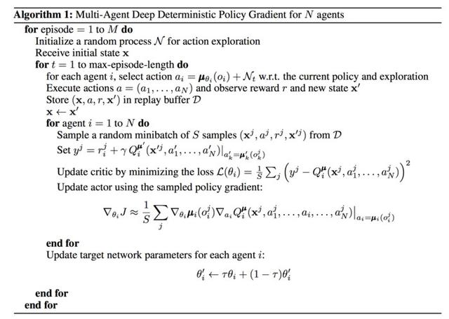
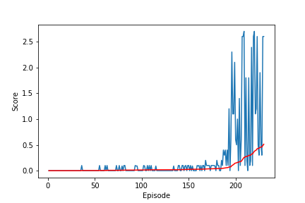

## Task 3: Collab Compet  

### Introduction  
This is the report for the task of Collab Compet. Basiclly, the task is required to train two agents to control rackets to bounce a ball over a net as much as they can. So there are more then one agent to train which is a multi-agent reinforcement learning problem. To solve it, the MADDPG algorithm was implemented here and finally solve this problem successfully. 

### Algorithm  
The General ideal of MADDPG is to train multiple agents with combination of DDPG. Each agent is a single DDPG agent.But, there is difference with naive DDPG. The input of signle agent's critic network includes more information, not only the agent itself but alse other agents' information, so the critic have a complete understanding to output Q values.
Here’s the pseudo-code of the algorithm:
   
However, in this task, the maddpg did not have a good performance if the the critic recieve whole agents' states and actions. But it did have a better performance if the critic only take the relative input with the agent itself, which was actually implemented in this task.

### Architecture   
| Actor   |  Critic |
| :------- |   :------- |
| BatchNorm1d (24)|  BatchNorm1d (26) |
| Linear (24, 400)|   Linear (26, 400) |
|RELU|  RELU|  
| Linear (400, 300)|Linear (404, 300)|
|RELU|  RELU| 
| Linear (300, 2)|Linear (300, 1)|
|tanh|   

### Parameters  
| | |
| :------- |   :------- |
| BUFFER_SIZE| 1e6 |
| BATCH_SIZE|   128|
| GAMMA|  0.99|  
| TAU|0.15|
| LR_ACTOR|  7e-4| 
| LR_CRITIC|3e-3|
| WEIGHT_DECAY| 0| 
| epsilon_min|  0.01|
| epsilon_decay | 0.95 |
|n_episodes | 2000|

### Results  
Environment solved in 230 episodes!	Average Score: 0.51  

 

### Ideas for Future Work
 - Try other algorithms such as Trust Region Policy Optimization (TRPO), Truncated Natural Policy Gradient (TNPG) and Proximal Policy Optimization (PPO)'
- Implement DDPG with HER (Hindsight Experience Replay) since the reward is sparse in this task. 

#### Reference  
1. https://arxiv.org/abs/1706.02275v3